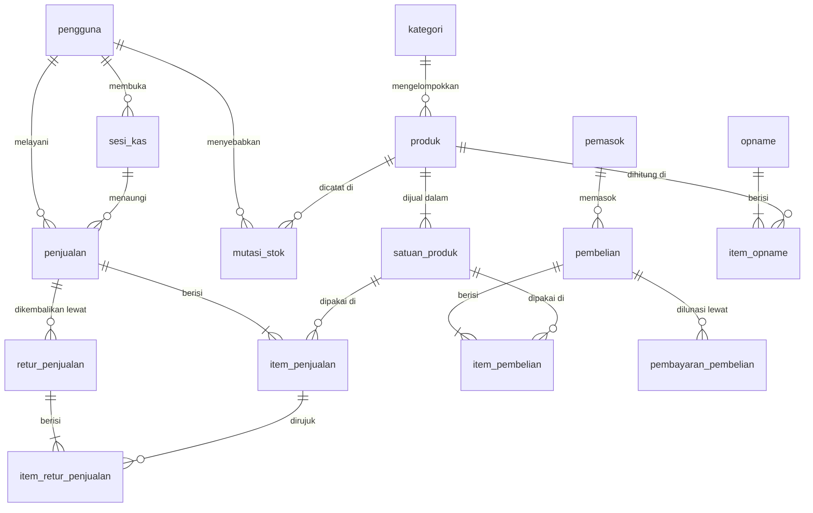

# 03. Model Data

## 3.1 Peta hubungan



Tujuh belas tabel, dikelompokkan menjadi enam urusan: **akses**, **katalog**, **buku besar stok**, **penjualan**, **pembelian**, dan **operasional**.

## 3.2 Kamus data

Tipe ditulis dalam istilah PostgreSQL. `BIGINT` untuk uang berarti **rupiah bulat**. `NUMERIC(14,3)` untuk jumlah berarti ketelitian sampai satu gram.

### pengguna

| Kolom | Tipe | Catatan |
|---|---|---|
| `id` | BIGSERIAL PK | |
| `nama_pengguna` | VARCHAR(50) UNIQUE | untuk masuk |
| `nama_lengkap` | VARCHAR(100) | tampil di struk |
| `sandi_hash` | TEXT | Argon2id |
| `peran` | ENUM | `pemilik` \| `kasir` |
| `aktif` | BOOLEAN | akun dinonaktifkan, tidak pernah dihapus |
| `dibuat_pada`, `diubah_pada` | TIMESTAMPTZ | |

### kategori

| Kolom | Tipe | Catatan |
|---|---|---|
| `id` | BIGSERIAL PK | |
| `nama` | VARCHAR(60) UNIQUE | |
| `diubah_pada` | TIMESTAMPTZ | dipakai sinkron beda-saja |

### produk

| Kolom | Tipe | Catatan |
|---|---|---|
| `id` | BIGSERIAL PK | |
| `kode` | VARCHAR(30) UNIQUE | kode internal toko |
| `nama` | VARCHAR(150) | |
| `kategori_id` | BIGINT FK NULL | |
| `satuan_dasar` | VARCHAR(20) | `bungkus`, `kg`, `botol` |
| `stok` | NUMERIC(14,3) | **salinan cepat**, bukan sumber kebenaran |
| `stok_minimum` | NUMERIC(14,3) | ambang peringatan |
| `hpp` | NUMERIC(14,4) | rupiah per satuan dasar, **pengecualian**, lihat §3.4 |
| `perlu_dilengkapi` | BOOLEAN | hasil "tambah cepat" saat transaksi |
| `uuid_klien` | UUID UNIQUE NULL | kunci idempotensi untuk produk yang lahir dari "tambah cepat" saat offline; kosong untuk produk yang dibuat lewat katalog |
| `aktif` | BOOLEAN | |
| `dibuat_pada`, `diubah_pada` | TIMESTAMPTZ | **indeks pada `diubah_pada`** untuk sinkron |

### satuan_produk

| Kolom | Tipe | Catatan |
|---|---|---|
| `id` | BIGSERIAL PK | |
| `produk_id` | BIGINT FK | |
| `nama` | VARCHAR(20) | `bungkus`, `dus`, `kg`, `karung` |
| `faktor` | NUMERIC(14,3) | berapa satuan dasar; **wajib > 0** |
| `harga_jual` | BIGINT | ditulis sendiri, **bukan** hasil perkalian |
| `barcode` | VARCHAR(32) UNIQUE NULL | menempel pada satuan, bukan produk |
| `is_dasar` | BOOLEAN | tepat satu per produk, `faktor` = 1 |
| `aktif` | BOOLEAN | satuan yang tidak dipakai lagi dinonaktifkan, tidak dihapus |
| `diubah_pada` | TIMESTAMPTZ | |

Batasan: `UNIQUE(produk_id, nama)`, dan tepat satu baris `is_dasar = true` per produk. Satuan dasar tidak boleh dinonaktifkan selama produknya masih aktif.

### mutasi_stok, sumber kebenaran stok

| Kolom | Tipe | Catatan |
|---|---|---|
| `id` | BIGSERIAL PK | |
| `produk_id` | BIGINT FK | |
| `tipe` | ENUM | `stok_awal` \| `penjualan` \| `retur_penjualan` \| `pembelian` \| `retur_pembelian` \| `penyesuaian` \| `opname` |
| `jumlah` | NUMERIC(14,3) | **bertanda**, negatif untuk keluar, dalam satuan dasar |
| `saldo_sesudah` | NUMERIC(14,3) | dihitung dalam transaksi yang sama |
| `hpp_saat_itu` | NUMERIC(14,4) | HPP setelah mutasi ini |
| `rujukan_tipe` | VARCHAR(30) | `penjualan`, `pembelian`, `opname`, … |
| `rujukan_id` | BIGINT NULL | |
| `alasan` | TEXT NULL | **wajib** saat `tipe = penyesuaian` |
| `pengguna_id` | BIGINT FK | |
| `dibuat_pada` | TIMESTAMPTZ | indeks `(produk_id, dibuat_pada)` |

**Tabel ini hanya menerima penambahan.** Tidak ada `UPDATE`, tidak ada `DELETE`, koreksi selalu berupa baris baru. Hak akses basis data untuk akun aplikasi dibatasi sesuai itu.

### penjualan

| Kolom | Tipe | Catatan |
|---|---|---|
| `id` | BIGSERIAL PK | |
| `uuid_klien` | UUID UNIQUE NOT NULL | **kunci idempotensi**, dibuat di perangkat |
| `nomor_nota` | VARCHAR(30) UNIQUE | `YYYYMMDD-K1-0007`, dibuat di perangkat |
| `sesi_kas_id` | BIGINT FK | |
| `kasir_id` | BIGINT FK | |
| `waktu_transaksi` | TIMESTAMPTZ | saat kejadian **di perangkat**, dipakai laporan |
| `waktu_diterima` | TIMESTAMPTZ | saat server menerima, dipakai diagnosa sinkron |
| `subtotal` | BIGINT | sebelum diskon nota |
| `diskon_nota` | BIGINT | |
| `pembulatan` | BIGINT | boleh negatif |
| `total` | BIGINT | |
| `metode_bayar` | ENUM | `tunai` \| `transfer` \| `qris` |
| `dibayar`, `kembalian` | BIGINT | |
| `status` | ENUM | `selesai` \| `sebagian_diretur` \| `diretur_penuh` |
| `catatan` | TEXT NULL | |

Memisahkan `waktu_transaksi` dari `waktu_diterima` itu penting: penjualan yang dibuat saat internet mati baru sampai berjam-jam kemudian. Laporan harus memakai waktu kejadian, bukan waktu kedatangan, kalau tidak, omzet hari Selasa bisa muncul di hari Rabu.

### item_penjualan

| Kolom | Tipe | Catatan |
|---|---|---|
| `id` | BIGSERIAL PK | |
| `penjualan_id` | BIGINT FK | |
| `produk_id`, `satuan_id` | BIGINT FK | rujukan untuk penelusuran |
| `nama_produk` | VARCHAR(150) | **salinan** saat transaksi |
| `nama_satuan` | VARCHAR(20) | **salinan** |
| `faktor` | NUMERIC(14,3) | **salinan** |
| `jumlah` | NUMERIC(14,3) | dalam satuan terpilih |
| `jumlah_dasar` | NUMERIC(14,3) | `jumlah × faktor` |
| `harga_satuan` | BIGINT | **salinan** |
| `diskon` | BIGINT | per baris |
| `subtotal` | BIGINT | dibulatkan sekali di sini |
| `hpp_saat_itu` | NUMERIC(14,4) | **salinan**, per satuan dasar |

Kolom bertanda "salinan" adalah alasan laporan laba bulan lalu tetap benar meski harga hari ini sudah berubah. Rujukan `produk_id` tetap ada untuk penelusuran, tetapi **tidak pernah** dipakai untuk menghitung ulang nilai historis.

### retur_penjualan & item_retur_penjualan

| Kolom | Tipe | Catatan |
|---|---|---|
| `retur_penjualan.id` | BIGSERIAL PK | |
| `penjualan_id` | BIGINT FK | nota asal |
| `nomor_retur` | VARCHAR(30) UNIQUE | |
| `waktu`, `pengguna_id` | | |
| `total_dikembalikan` | BIGINT | |
| `alasan` | TEXT | wajib |
| `item_retur_penjualan.item_penjualan_id` | BIGINT FK | baris asal |
| `jumlah`, `jumlah_dasar` | NUMERIC(14,3) | tidak boleh melebihi sisa baris asal |
| `nilai_dikembalikan` | BIGINT | |

### pemasok

`id`, `nama`, `telepon`, `alamat`, `catatan`, `aktif`.

### pembelian

| Kolom | Tipe | Catatan |
|---|---|---|
| `id` | BIGSERIAL PK | |
| `nomor_faktur` | VARCHAR(50) | nomor dari pemasok |
| `pemasok_id` | BIGINT FK | |
| `tanggal_faktur`, `tanggal_jatuh_tempo` | DATE | |
| `status` | ENUM | `draft` \| `diterima` |
| `subtotal`, `diskon`, `total` | BIGINT | |
| `dibayar` | BIGINT | jumlah pelunasan sejauh ini |
| `status_bayar` | ENUM | `belum` \| `sebagian` \| `lunas` |
| `waktu_diterima` | TIMESTAMPTZ NULL | terisi saat status jadi `diterima` |
| `pengguna_id`, `catatan` | | |

`UNIQUE(pemasok_id, nomor_faktur)`, satu pemasok tidak menerbitkan dua faktur bernomor sama.

### item_pembelian

`id`, `pembelian_id`, `produk_id`, `satuan_id`, `jumlah`, `jumlah_dasar`, `harga_beli` (per satuan terpilih), `harga_beli_dasar` (per satuan dasar), `subtotal`.

### pembayaran_pembelian

`id`, `pembelian_id`, `tanggal`, `jumlah`, `metode`, `catatan`, `pengguna_id`.

### sesi_kas

| Kolom | Tipe | Catatan |
|---|---|---|
| `id` | BIGSERIAL PK | |
| `kasir_id` | BIGINT FK | |
| `waktu_buka` | TIMESTAMPTZ | |
| `modal_awal` | BIGINT | |
| `waktu_tutup` | TIMESTAMPTZ NULL | |
| `kas_sistem` | BIGINT NULL | modal awal + penjualan tunai − retur tunai |
| `kas_fisik` | BIGINT NULL | hasil hitung manual |
| `selisih` | BIGINT NULL | `kas_fisik − kas_sistem` |
| `catatan` | TEXT NULL | wajib bila `selisih ≠ 0` |
| `status` | ENUM | `terbuka` \| `tertutup` |

Hanya boleh ada satu sesi `terbuka` per kasir pada satu waktu.

### opname & item_opname

| Kolom | Tipe | Catatan |
|---|---|---|
| `opname.id` | BIGSERIAL PK | |
| `nomor`, `tanggal`, `pengguna_id` | | |
| `status` | ENUM | `draft` \| `diposting` |
| `waktu_posting` | TIMESTAMPTZ NULL | |
| `item_opname.produk_id` | BIGINT FK | |
| `stok_sistem` | NUMERIC(14,3) | dibekukan saat baris dibuat |
| `stok_fisik` | NUMERIC(14,3) | hasil hitung |
| `selisih` | NUMERIC(14,3) | |
| `catatan` | TEXT NULL | |

### pengaturan

Tabel kunci–nilai: `kunci VARCHAR PK`, `nilai JSONB`, `deskripsi TEXT`.

| Kunci | Contoh | Guna |
|---|---|---|
| `nama_toko`, `alamat_toko`, `telepon_toko` | `"Toko Berkah"` | kepala struk |
| `pembulatan_nota` | `0` \| `100` \| `500` | pembulatan total |
| `batas_hari_retur` | `7` | batas waktu retur |
| `teks_kaki_struk` | `"Terima kasih"` | kaki struk |
| `cetak_otomatis` | `false` | dialog cetak muncul sendiri setelah transaksi; mati sampai printer dibeli |
| `peringatan_stok_minus` | `true` | tampilkan peringatan saat stok minus |

## 3.3 Aturan integritas

Enam aturan ini berbeda dari **enam aturan bisnis** di [spec induk §6](../spesifikasi.md), yang di sana menyangkut cara sistem berperilaku, yang di sini menyangkut apa yang dijaga basis data. Rujuk keduanya dengan menyebut nomor bagiannya, bukan nomor aturannya saja.

**1, Buku besar dan salinan harus cocok.** Untuk setiap produk, `produk.stok` wajib sama dengan `SUM(mutasi_stok.jumlah)`. Keduanya ditulis dalam satu transaksi basis data yang sama. Ada kueri pemeriksa yang dijalankan berkala:

```sql
SELECT p.id, p.nama, p.stok, COALESCE(SUM(m.jumlah), 0) AS saldo_buku
FROM produk p
LEFT JOIN mutasi_stok m ON m.produk_id = p.id
GROUP BY p.id, p.nama, p.stok
HAVING p.stok <> COALESCE(SUM(m.jumlah), 0);
```

Hasil yang tidak kosong berarti ada bug, bukan data yang perlu dirapikan diam-diam.

**2, Perubahan stok mengunci barisnya.** Setiap operasi yang menyentuh stok atau HPP memulai transaksi, melakukan `SELECT … FOR UPDATE` pada baris produk, menghitung saldo dan HPP baru, menulis `mutasi_stok`, memperbarui `produk`, lalu berkomitmen. Tanpa penguncian, dua penjualan yang tiba bersamaan bisa membaca saldo yang sama dan menghasilkan `saldo_sesudah` yang salah.

**3, HPP hanya berubah saat barang masuk.** Rumusnya:

```
hpp_baru = (stok_lama × hpp_lama + jumlah_masuk × harga_beli_dasar)
           ÷ (stok_lama + jumlah_masuk)
```

Dua penjagaan: bila `stok_lama` bernilai nol atau negatif, HPP baru langsung sama dengan `harga_beli_dasar`, merata-ratakan terhadap stok negatif menghasilkan angka yang tidak berarti. Dan penjualan **tidak pernah** mengubah HPP.

**4, Retur tidak boleh melebihi asalnya.** Jumlah seluruh retur atas satu baris nota wajib ≤ jumlah baris itu. Diperiksa di dalam transaksi, bukan hanya di tampilan.

**5, Nilai uang tidak pernah negatif** kecuali `pembulatan` dan `selisih` pada sesi kas, yang memang bisa ke dua arah. Sisanya dijaga dengan `CHECK`.

**6, Data tidak dihapus.** Produk, pemasok, dan pengguna dinonaktifkan lewat kolom `aktif`. Nota dan mutasi tidak punya jalur penghapusan sama sekali. Toko yang sudah berjalan tidak boleh kehilangan jejak.

## 3.4 Kenapa HPP boleh berdesimal padahal uang tidak

[Bab 02](02-arsitektur.md) menetapkan uang selalu bilangan bulat rupiah. HPP adalah **satu-satunya pengecualian**, dan ini disengaja.

HPP bukan jumlah yang dibayarkan siapa pun. Ia **rata-rata turunan**, sebuah tarif per satuan dasar. Membulatkannya ke rupiah terdekat terdengar tidak berbahaya, sampai dikalikan faktor: satu dus berisi 40 bungkus, sehingga sisa pembulatan Rp0,33 per bungkus menjadi meleset Rp13 per dus. Meleset itu menumpuk di setiap penjualan dan akhirnya muncul sebagai laba yang tidak pernah bisa dicocokkan.

Karena itu `hpp` dan seluruh salinannya disimpan `NUMERIC(14,4)`. Pembulatan ke rupiah dilakukan **sekali saja**, di ujung, saat nilai laba disajikan.

Aturannya jadi: *jumlah yang dibayar* selalu bulat; *tarif yang dihitung* boleh berdesimal.

## 3.5 Contoh terhitung

Diperiksa oleh uji otomatis di [bab 10](10-strategi-pengujian.md), supaya rumus di atas tidak hanya benar di atas kertas.

**Beli lalu jual dengan satuan berbeda**, Indomie, satuan dasar `bungkus`, satuan `dus` berfaktor 40:

| Langkah | Kejadian | Stok (bungkus) | HPP |
|---|---|---|---|
| Awal | Tidak ada | 0 | 0 |
| Terima 2 dus @Rp112.000 | +80 bungkus, harga dasar Rp2.800 | 80 | Rp2.800,0000 |
| Terima 1 dus @Rp120.000 | +40 bungkus, harga dasar Rp3.000 | 120 | `(80×2800 + 40×3000) ÷ 120` = **Rp2.866,6667** |
| Jual 3 bungkus @Rp3.500 | −3 | 117 | tak berubah |
| Jual 1 dus @Rp130.000 | −40 | 77 | tak berubah |

Laba kotor kedua penjualan:

```
3 bungkus : 3 × 3.500  − 3 × 2.866,6667  = 10.500  − 8.600,00   = 1.900,00
1 dus     : 130.000    − 40 × 2.866,6667 = 130.000 − 114.666,67 = 15.333,33
                                                        total   = 17.233,33
                                          dibulatkan sekali di ujung → Rp17.233
```

Perhatikan satu dus dijual Rp130.000, bukan `40 × 3.500 = 140.000`. Selisih itu bukan kesalahan, justru itulah alasan pembeli mengambil per dus, dan itulah sebabnya harga tiap satuan **ditulis sendiri, bukan dihitung dari perkalian** ([ADR-0005](../adr/0005-satuan-bertingkat.md)).

**Barang curah:** beras satuan dasar `kg`, HPP Rp12.500, dijual `1,5` kg @Rp14.000/kg → stok berkurang `1,500`, subtotal `Rp21.000`, laba `1,5 × (14.000 − 12.500)` = **Rp2.250**.
